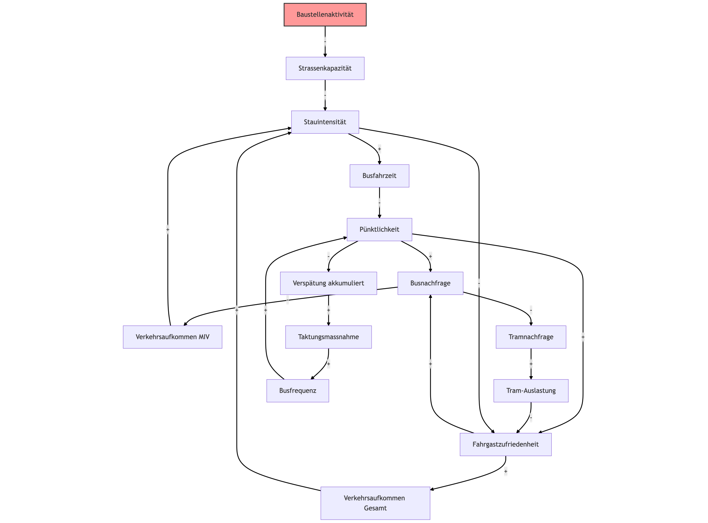

# Mini Challenge: Systemanalyse einer innerstädtischen Baustelle (mss – LE 1)

## 1. Projektkontext
**Von der vagen Sorge zur Systemkarte**

Der öffentliche Verkehr (ÖV) ist ein komplexes, dynamisches System. Eine Baustelle stellt darin eine exogene Störung dar. Sie verändert Verkehrsflüsse, Fahrzeiten, das Fahrgastverhalten und die operative Effizienz.

### Forschungsleitende Fragen
> **Hauptfrage:** Wie beeinflusst eine temporäre Baustelle auf einer Hauptverkehrsachse die Pünktlichkeit und Auslastung von Bus- und Tramlinien im Stadtverkehr?

> **Erweiterte Frage (Intervention):** Inwiefern kann eine **10-minütige Taktverdichtung** (Intervention) während der Stosszeiten die negativen Effekte auf CO2-Emissionen und Passagierzufriedenheit kompensieren?

---

## 2. Definition der Systemgrenzen
Das Modell konzentriert sich auf den innerstädtischen Personenverkehr. Regionale Linien werden ausgeblendet.

*Hinweis zur Visualisierung: Die Systemgrenzen müssen in den folgenden Systemkarten explizit als Rahmen eingezeichnet werden.*

| Dimension | Abgrenzung / Definition |
| :--- | :--- |
| **Räumlich** | Ein städtisches Quartier mit **1 Buslinie** (betroffen) und **1 Tramlinie** (Ausweichoption). |
| **Zeitlich** | Fokus auf **Berufsverkehr (07:00–09:00 Uhr)** über mehrere Tage (Lerneffekte). |
| **Akteure** | Busse, Trams, Fahrgäste (Pendler), Stadtverwaltung. |

---

## 3. Artefakt: Cluster-Systemkarte & Gedankenprozess
*Visualisierung von Schlüsselfaktoren und deren Wechselwirkungen.*

In einem ersten Schritt wurden Einflussfaktoren unstrukturiert gesammelt (siehe Anhang "Unstrukturierte Clusterkarte"), bevor sie thematisch gruppiert wurden.

### Identifizierte Cluster & Variablen (Standardisiert)
* **Cluster 1: Infrastruktur & Verkehr** (Variablen: `Baustellenaktivität`, `Strassenkapazität`, `Verkehrsaufkommen`, `Stauintensität`)
* **Cluster 2: Betrieb & Angebot** (Variablen: `Busfrequenz`, `Busfahrzeit`, `Pünktlichkeit`, `Verspätung`)
* **Cluster 3: Nutzerverhalten** (Variablen: `Fahrgastzufriedenheit`, `Busnachfrage`, `Tramnachfrage`, `Tram-Auslastung`)
* **Cluster 4: Stadtplanung** (Variablen: `Kommunikationsmassnahmen`, `Taktung`)

### Wesentliche Wirkungsketten (Hypothesen)
1.  **Kaskadeneffekt:** `Baustellenaktivität` (extern) → `Strassenkapazität` ↓ → `Stauintensität` ↑ → `Busfahrzeit` ↑ → `Pünktlichkeit` ↓
2.  **Verlagerung:** `Pünktlichkeit` ↓ → `Fahrgastzufriedenheit` ↓ → `Busnachfrage` ↓ → `Tramnachfrage` ↑
3.  **Rebound:** `Tramnachfrage` ↑ → `Tram-Auslastung` ↑ → `Fahrgastzufriedenheit` (System) ↓

---

## 4. Artefakt: Stakeholder Map
*Hinweis: Hier muss eine grafische Darstellung der Einflusssphären eingefügt werden.*

* **Fahrgäste:** Kern-Stakeholder (Nutzenmaximierer).
* **Bus-Betrieb:** Direkt betroffen (Verlierer der Situation).
* **Tram-Betrieb:** Profiteur (Nachfrage), aber kapazitätsgefährdet.
* **Stadt / Verkehrsbetriebe:** Regulator (Steuerung durch Intervention).

---

## 5. Artefakt: Causal Loop Map (Kausalschleifen-Diagramm)
*Identifikation der dynamischen Rückkopplungen.*

Das Diagramm nutzt ausschliesslich die in Abschnitt 3 definierten Variablen. Exogene Faktoren (Baustelle) wirken von aussen auf die Schleifen ein, sind aber kein Teil der Feedback-Loop.

### Systemdynamik: Die Schleifen

#### Verstärkende Schleifen (R – Reinforcing)
*Destabilisierende Faktoren.*

* **R1: Teufelskreis der Überlastung (Verlagerung)**
    `Fahrgastzufriedenheit` ↓ → `Busnachfrage` ↓ → `Tramnachfrage` ↑ → `Tram-Auslastung` ↑ → `Fahrgastzufriedenheit` (Gesamt) ↓
    *Beschreibung:* Unzufriedene Busfahrgäste wechseln aufs Tram. Das Tram wird überfüllt, was den Komfort senkt und die Zufriedenheit weiter drückt (Startknoten = Endknoten).

* **R2: Die Stau-Spirale**
    `Stauintensität` ↑ → `Busfahrzeit` ↑ → `Pünktlichkeit` ↓ → `Busnachfrage` ↓ → `Verkehrsaufkommen` (MIV) ↑ → `Stauintensität` ↑
    *Beschreibung:* Wenn der Bus im Stau steht und unpünktlich wird, steigen Leute auf das Auto (MIV) um, was den Stau weiter verschärft.

#### Abschwächende Schleifen (B – Balancing)
*Stabilisierende Faktoren.*

* **B1: Betriebliche Anpassung**
    `Pünktlichkeit` ↓ → `Verspätung` ↑ → `Taktung` (Intervention) ↑ → `Busfrequenz` ↑ → `Pünktlichkeit` / `Wartezeit` (korrigiert)
    *Beschreibung:* Der Betrieb reagiert auf Verspätungen mit mehr Fahrzeugen, um die Servicequalität wiederherzustellen.

* **B2: Entlastung durch Meidung**
    `Stauintensität` ↑ → `Fahrgastzufriedenheit` ↓ → `Verkehrsaufkommen` (Gesamt) ↓ → `Stauintensität` ↓
    *Beschreibung:* Wenn das System kollabiert (extremer Stau), meiden Leute das Gebiet komplett, was den Stau wiederum abbaut.