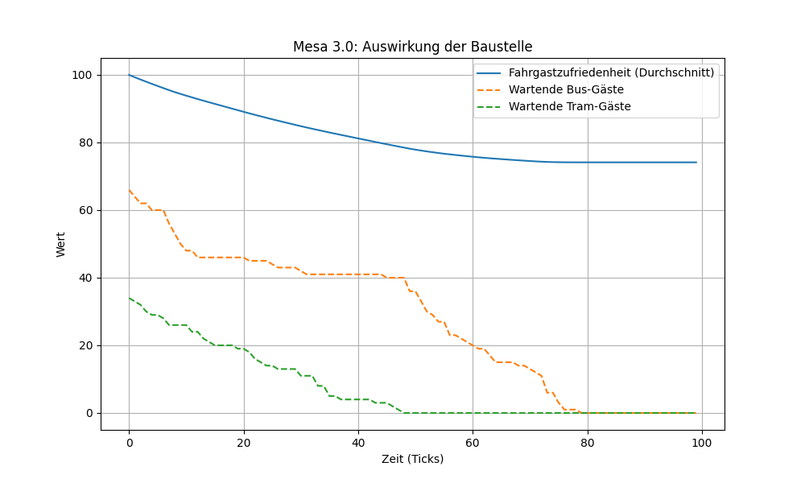
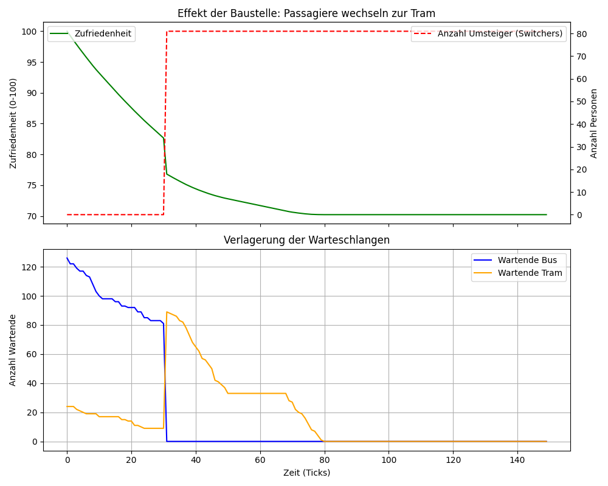

# Ergebnisse der Agentenbasierten Simulation

## 1. Iteration: Basis-Modell ohne Verhaltensänderungen

Figure 2: Basis-Modell

In einem ersten Schritt wurde das System „naiv“ modelliert. Dabei existierte zwar die baustellenbedingte Störung des Busverkehrs, die Agenten besaßen jedoch keine Möglichkeit, auf die Verzögerung zu reagieren. Sie verharrten statisch an ihrer Haltestelle, unabhängig von der Wartezeit.

## Beobachtung (siehe Figure 2)

Wie in der ersten Grafik („Mesa 3.0: Auswirkung der Baustelle“) zu sehen ist, sinken die Warteschlangen linear ab. Die Passagiere im Bus (orange Linie) werden zwar langsamer abgearbeitet als die Tram-Gäste (grüne Linie), aber es findet keine Interaktion zwischen den Systemen statt. Die Unzufriedenheit (blaue Linie) sinkt stetig, aber sanft.

**Kritik:** Diese Modell bildet die Realität unzureichen ab, das es die in LE1 definierte **verstärkende Schleife R1 (Nachfrageverschiebung)** ignoriert. In einem realen System verharrt ein Akteur nicht passiv, sondern passt sein verhalten an (Modal Shift).

## 2. Iteration: Implementierung eines „Kipp-Punkts“ (Tipping Point)

Figure 1: Kipp-Punkt

Um die Dynamik der Kausaldiagramme aus LE1 korrekt abzubilden, wurde das Agenten-Verhalten erweitert („Switching Logic“). Es wurde ein **Schwellenwert (Threshold)** eingeführt: Sobald die Wartezeit eines Bus-Agenten 30 Zeiteinheiten (Ticks) überschreitet, verliert der Agent die Geduld und wechselt zum Tram.

**Analyse der Trajektorien (siehe Figure 1):** Die Ergebnisse der erweiterten Simulation zeigen nun deutliche nichtlineare Effekte und Emergenz:

1. **Der Kipp-Punkt (Tick 30):** Im unteren Teil der Grafik ist bei Tick 30 ein abruptes Ereignis erkennbar. Die Warteschlange der Busse (blau) fällt schlagartig auf Null, während die Warteschlange der Trams (orange) im exakt gleichen Moment explodiert (von ca. 10 auf ca. 90 Personen). Dies visualisiert den massenhaften, panikartigen Umstieg der Fahrgäste.

2. **Indirekter Rebound-Effekt:** Obwohl die Baustelle physisch nur den Bus blockiert, führt das adaptive Verhalten der Agenten dazu, dass das Tram-System vollständig überlastet wird. Die Simulation zeigt, dass die Tram-Haltestelle bis Tick 80 benötigt, um den plötzlichen Andrang abzubauen. Die Störung diffundiert also von einem Teilsystem in das andere.

3. **Auswirkung auf die Zufriedenheit:** Die grüne Kurve (oben) zeigt, dass der Moment des Umstiegs „teuer“ für die Zufriedenheit ist. Bei Tick 30 macht die Kurve einen deutlichen Knick nach unten. Der Stress des Umsteigens und die Überfüllung des Trams führen zu einer dauerhaft niedrigeren Kundenzufriedenheit als im Basis-Modell.

## Fazit & Validierung:

Die Simulation bestätigt die Hypothesen aus der **Cluster-Systemkarte (LE1)**. Sie zeigt erfolgreich, dass lokale Entscheidungen einzelner Agenten (Individuum: „Ich will nicht mehr warten“) zu globalen Phänomenen führen (System: Zusammenbruch des Tram-Takts), die ohne Simulation schwer vorhersehbar wären.

Der Vergleich der beiden Iterationen verdeutlicht, dass statische Modelle für komplexe Verkehrssysteme ungeeignet sind und erst durch die Einführung von Feedback-Mechanismen (hier: Wartezeit → Entscheidungswechsel) realistische Szenarien entstehen.